<!DOCTYPE html>
<html lang="es">
<head>
    <title>BLOGS PASANTIAS</title>
    <link rel="preconnect" href="https://fonts.googleapis.com">
    <link rel="preconnect" href="https://fonts.gstatic.com" crossorigin>
    <link href="https://fonts.googleapis.com/css2?family=Playfair+Display:ital,wght@0,400..900;1,400..900&display=swap" rel="stylesheet">
    <link rel="stylesheet" href="style.css">   
</head>
<body>
    <header>
        <h1 id="titulo">EXPERIENCIAS EN FCT DE LA UNIDAD EDUCATIVA "GUAYAQUIL"</h1>
        <footer>
            <section>
            <a href="#conf1">EXP. SAMANTHA</a>
            <h>|
                |
                |
                |
                |
                |
                |
                |
                |
            </h>
            <a href="#conf2">EXP. LUIGGI</a>
            <h>|
                |
                |
                |
                |
                |
                |
                |
                |
            </h>
            <a href="#conf3">EXP. LENIN</a>
            <h>|
                |
                |
                |
                |
                |
                |
                |
                |
            </h>
            <a href="#conf4">EXP. NAYELI</a>
            <h>|
                |
                |
                |
                |
                |
                |
                |
                |
            </h>
            <a href="#conf5">EXP. ANJENY</a>
            <h>|
                |
                |
                |
                |
                |
                |
                |
                |
            </h>
            <a href="#conf6">EXP. ERIKA</a>
            <h>|
                |
                |
                |
                |
                |
                |
                |
                |
            </h>
            <a href="#conf7">EXP. MONSE</a>
            <h>|
                |
                |
                |
                |
                |
                |
                |
                |
            </h>
            <a href="#conf8">EXP. ADRIANO</a>
            <h>|
                |
                |
                |
                |
                |
                |
                |
                |
            </h>
            <a href="#conf9">EXP. LUDWIN</a>
            <h>|
                |
                |
                |
                |
                |
                |
                |
                |
            </h>
            <a href="#conf10">EXP. ANTHONY</a>
            <h>|
                |
                |
                |
                |
                |
                |
                |
                |
            </h>
            <a href="#conf11">EXP. ODALYS</a>
            <h>|
                |
                |
                |
                |
                |
                |
                |
                |
            </h>
            <a href="#conf12">EXP. ELVIS</a>
            <h>|
                |
                |
                |
                |
                |
                |
                |
                |
            </h>
            <a href="#conf13">EXP. KEVIN</a>
            </section>
        </footer>
    </header>
    <section class="container">
        <article>
            <h2>INTRODUCCIÓN</h2>
            

                Las experiencias de cada estudiante de tercero bachillerato las redactamos para dar a conocer como les fue en el transcurso 
                del mes de febrero de 2024, conocemos sus anectdotas la experiencia que obtuvieron y que ganaron gracias a las FCT.
     </article>
    <article>
            <h2>OBJETIVO</h2>
            

                .-Ganar experiencia en base a la carrera seguida en la institución.
            

            

                .-Tener una experiencia cercana a lo que es el ambito laboral.
            

        </article>
        <article class="post">
                <h2 id="conf1">MI EXPERIENCIA EN F.C.T.</h2>
                
Mi experiencia fue muy buena, ya que los trabajadores 
                fueron muy amables con nosotros, nos enseñaron muchas 
                cosas estudiantes de electrónica de consumo, nos enseñaron 
                sobre computadoras e impresoras a limpiarlas a fono y 
                dejarlas como nuevas, a cambiar partes de laptops con mucha 
                delicadeza y explicarnos el funcionamiento de cada uno. Nos 
                enseñaron a instalar, clonar cualquier clase de Windows, 
                programar y sistemas operativos fue la mejor experiencia ya 
                que nuestra jefa fue una buena persona con nosotras y siempre 
                nos daba pequeños detalles. Dg Soluciones cumplió mis expectativas, 
                como empresa seria y confiable. 

                
                
Samantha Pilatuña

        </article>
        <article class="post1">
                <h2 id="conf2">EXPERIENCIA EN PASANTIAS </h2>
                
Realice las pasantías en un taller de electrónica de consumo en 
                    el cual mi experiencia fue mala la persona que estaba encargada de 
                    mi siempre fue grosera, también escuche a varios clientes quejarse 
                    por el trato y sobre cosas que se han vuelto a dañar en un corto tiempo 
                    fuera de esto si aprendí muchas cosas sobre microondas, calefones, cocinas, 
                    refrigeradoras, lavadoras y secadoras hubieron días en los que realizamos 
                    visitas a domicilio para mantenimientos de lavadoras, me corte varias veces 
                    se encontraba  cerca de mi domicilio y podía ir a comer en la hora del almuerzo 
                    en mi casa aunque a veces no me deban mucho tiempo para comer porque me llamaban 
                    para volver al taller, otra cosa buena de ahí es que el dueño del taller si 
                    explicaba muy bien lo que tenía que realizar.
                    Realmente me arrepiento de hacer pasantías en ese lugar se sintió como verdadero 
                    trabajo por la actitud, exigencia en el área de trabajo y también en las horas 
                    de trabajo en las horas de comida y salida.
                

                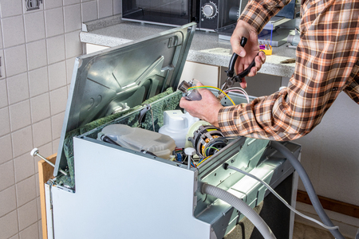
                
Luiggi Pincay 

        </article>
        <article>
                <h2 id="conf3">EXPERIENCIAS MARAVILLOSAS</h2>
                

                    Mi experiencia en las fct fue maravillosa porque aprendí mas a como arreglar cosas 
                    electrónicas. También que hay que preguntar antes de hacer alguna cosa porque puedo 
                    dañar algo, también aprendí que cuando te dan garantía jamás vayas arreglar en ese 
                    lugar mejor ve a un taller 😊, también que si yo solo arreglo algo yo me gano 
                    ganancias, también que todas las cosas electrónicas  tienen reparación y cuando 
                    reparo algo el costo mínimo es de 5$ pero fue maravilloso en la ELECTRONICA  TV 
                    LED, también que ahora sé que son FCT pero tenemos que por lo menos nos pague  
                    unos 5$ yo la primera vez que arregle y le di mantenimiento a una aspiradora el 
                    dueño no hizo nada y cobro 25$ y yo solo vi como el dueño se llevó esa dinero a vaca ☹.
                

                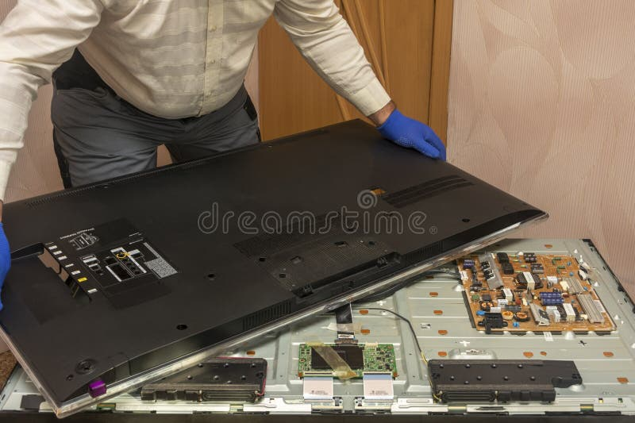
                
Lenin Pacha

        </article>
        <article>
                <h2 id="conf4">MI EXPERIENCIA EN FCT.</h2>
                
Mi experiencia en FCT fue un poco extraña ya que fuimos a una empresa que se 
                    llama ECUASEG a instalar cámaras, al principio no sabíamos que íbamos hacer, 
                    lo bueno fue que nos recibieron bien y el Ing. Chévere, de ahí nos puso a 
                    barrer y a limpiar el local.
                    Al siguiente día nos hizo hacer unos documentos de facturación de vienes 
                    vendidos y en eso pasamos hasta que ya nos comenzó a llevar a instalar cámaras 
                    por diferentes lugares y no era nada estresante al contrario era algo 
                    divertido aun que a veces nos dejaba en el local a atender a clientes lo cual 
                    fue un poco raro ya que no teníamos experiencia en el ámbito, el Ing. Nos fue 
                    enseñando de como debemos atender y dar a conocer al cliente las especificaciones 
                    del producto y las distintas configuraciones que tenia cada una de las cámaras 
                    y así fue todos los días hasta que llego el día de despedirnos y se pudo hacer 
                    una pequeña cena, fue algo lindo por que se portaron buenos los Ing.
                    

                    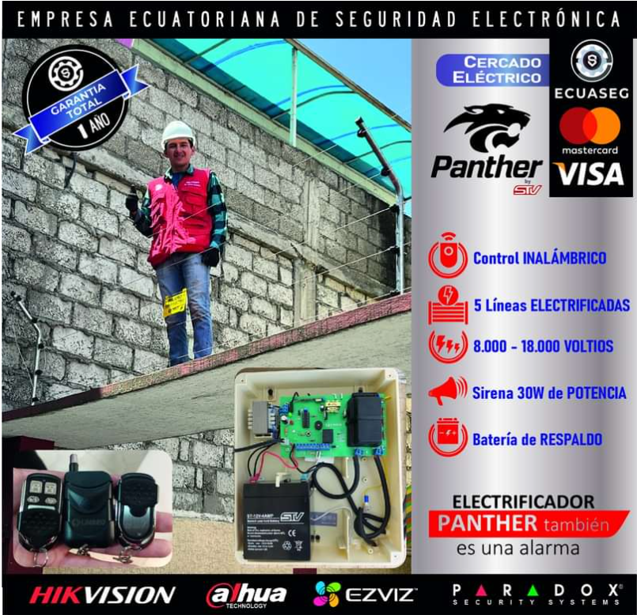
                    
Nayeli Sailema

        </article>
        <article>
                <h2 id="conf5">F.C.T</h2>
                

                    La experiencia en el mes de febrero en FCT, fue muy agradable ya que aprendí 
                    muchas cosas nuevas las cuales me sirvieron en su momento y me servirán para 
                    toda la vida, en todo ese mes hice amigos y amigas nuevos los cuales me alegraron 
                    mi día, y los primeros días eran difíciles ya que nos estábamos acostumbrados a 
                    una jornada laboral en todo ese tiempo aprendí a clonar computadoras a instalar 
                    Windows, a cambiar discos duros a cambiar cartuchos de impresoras, a probar todos 
                    los parlantes y también hicimos junto a un empleado, el inventario de toda la tienda o local 2024.
                    Fue una experiencia muy bonita ya que en ningún momento hubo abusos, maltratos o 
                    cosas irrespetuosas, al contrario, hubo mucho cariño, respeto, comprensión en todos 
                    los aspectos, me gusto mucho mi experiencia y no me arrepiento al contrario 
                    desearía volverá vivirla. DG Soluciones.
                

                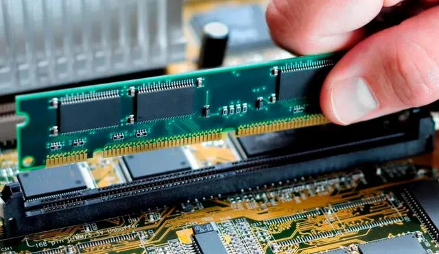
                
Anjeny Oberto

        </article>
        <article>
                <h2 id="conf6">F.C.T.</h2>
                

                    Mi experiencia en el mes de febrero en F.C.T. fue muy agradable las personas 
                    del lugar eran muy amables y comprensibles las actividades que teníamos que hacer 
                    al inicio eran complejas pero después de que nos guiaron todo era más fácil tuvieron 
                    paciencia para explicarnos cosa por cosa además de la administración y las 
                    instalaciones aprendimos muchas cosas de electrónica que nos va a servir para 
                    la especialidad y un futuro trabajo de la misma al final nos despedimos  con una 
                    gran sonrisa y agradecimiento a las personas del lugar.
                

                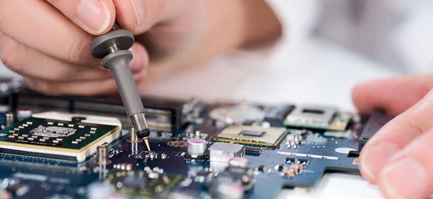
                
Erika Tobar

        </article>
        <article>
                <h2 id="conf7"> MI EXPERIENCIA EN F.C.T.</h2>
                

                    Mi experiencia en el Servicio Automotriz Quicaliquin fue divertida además aprendí 
                    muchas cosas ya que mi profesor Medardo Silva me enseño y explico poco a poco 
                    me explicaba todo el funcionamiento eléctrico de los carros híbridos y un poco 
                    de mecánica, además en el taller todos los trabajadores eran muy buena gente conmigo. 
                    Una de mis tantas experiencias que tuve fue que estábamos armando una celda de 
                    las baterías hibridas y se provoco un corto al conectarlas creó un chispazo lo 
                    cual me asusto, pero a quien asusto más fue a mi profesor.
                

                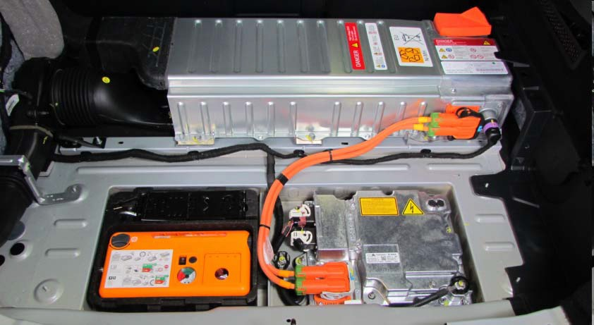
                
Monserrat Sisalema

        </article>
        <article>
                <h2 id="conf8">EXPERIENCIA EN PASANTIAS</h2>
                

                    Mi experiencia en pasantías fue buena me enseñaron muchas cosas sobre lo 
                    eléctrico en los autos, camiones, buses, tráilers, mulas, etc.
                    Loa jefes fueron muy buenos conmigo me ayudaron y me enseñaron e incluso 
                    un trabajador era exestudiante del colegio “Guayaquil” y me llevaba super 
                    bien el me enseño varias cosas por ejemplo corrientes del auto, cambio de 
                    fusibles, detección de cambio de corrientes, uso del escáner, desarmado de arranques, alternadores y compresores.
                    La empresa electromecánica Ambato hice muchas cosas que me pusieron en un 
                    estado de conocimiento excelente, muchas veces me ocurrieron cosas de peligro 
                    por ejemplo cuando un tráiler casi me pisa la pierna.   
                    Me pegaron bien era muy bueno y estaba entretenido aprendiendo, pero lamentablemente se acabó las pasantías.
                

                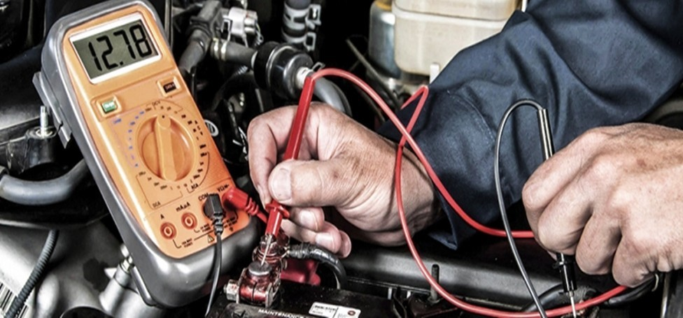
                
 Adriano Quispilema

        </article>
        <article>
                <h2 id="conf9">ANECDOTAS</h2>
                

                    Todo esto empieza en el momento que fuimos a realizar la solicitud para las F.C.T., 
                    el cual fue un trámite, por ejemplo, el día de presentar la carpeta un compañero 
                    se olvida su carpeta en el taller de electrónica, pero al final todo salió bien.
                    El día lunes 5 de febrero fue nuestro primer día de trabajar el cual me enseñaron 
                    a "programar medidones" a ver la "resistencia de cada medidor", etc. Al principio 
                    fue un poco incomodo porque no conversamos con nadie, pero con el paso del tiempo 
                    fuimos tomando confianza hasta el punto de llevarnos con los ingenieros. En nuestro 
                    ultimo día de pasantías realizamos un reconteo de los medidores hecho por nosotros, 
                    nuestra sorpresa fue que logramos hacer 1800 medidores, debe recalcar que nuestra 
                    hora de entrada fue de 8:00 AM hasta 16:30 PM, y nuestra hora de almuerzo era de 12:00 PM hasta 14:00 PM.
                    Por último, ay que recalcar que nuestra experiencia fue maravillosa en la empresa y salimos de ahí agradecidos.
                

                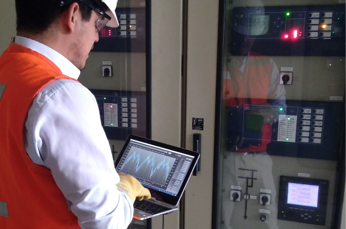
                
Ludwin Ruiz

        </article>
        <article>
                <h2 id="conf10">PASANTIAS</h2>
                

                    Las experticias vividas en las pasantías realizadas el mes de febrero son inolvidables 
                    debido a que los conocimientos adquiridos en este tiempo son de alto valor debido a que 
                    tenemos una viste previa de lo que nos espera en la vida en este ámbito laboral. En 
                    lo personal al asistir a mis pasantías en una institución privada que se dedica a realizar 
                    kits de robótica educativa aprendemos que la robótica para niños, ayuda en su desarrollo personal y 
                    como tal ser parte del desarrollo, armado y producción de estos kits, con tus conocimientos 
                    de electrónica es una de las experiencias más inolvidables.
                    Para aprender y poder ayudar en la empresa nos capacitaron y nos dieron recomendaciones de 
                    cómo utilizar maquinas laser, así como realizar los programas y atender a estación de soldadura 
                    de componentes. Definitivamente las experiencias vividas son magnificas y de alto valor para mi 
                    persona, siendo asi que agradezco a la empresa que me recibió y a los trabajadores que me enseñaron su área de trabajo.
                

                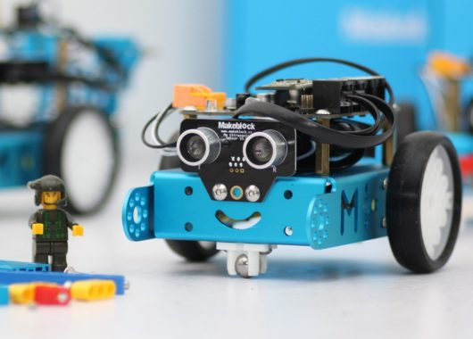
                
Anthony Toabanda

        </article>
        <article>
                <h2 id="conf11">MIS PASANTIAS</h2>
                

                    Cuando fui a pasantías no sabía nada fui con tres chicos del colegio cuando llegamos nos 
                    asignaron un trabajo, a mí me pusieron en bodega con la Sra. Gabriela que era encargada de bodega, 
                    era muy amable ahí hacíamos de contar material eléctrico o también mandábamos material a otros 
                    locales a mi me sorprendía mucho la Sra. Gabriela ya que ella sabia mucho y por códigos y había mucho 
                    material  eléctrico yo no sabía algunos materiales así que fue complicado al principio después algunas 
                    cosas ya sabía y aprendí lo que no me gustaba es que había un taller y el encargado del taller me hizo 
                    limpiar el baño yo llore JAJAJA, después me mandaron a ventas y en ventas también aprendí algunos materiales 
                    eléctricos, yo trabaje en la empresa TESLA, también aprendí hacer resistencias para hacer eso habían 
                    muchas pasos desde que un tubo se haga blando y después le pasan por una maquina para que este recto. 
                    La verdad no me gusta mucho ya que pensé que iba a programar y aprender a conectar cosas y también 
                    aprendí como es un trabajo. Y al final solo me despedí y me dieron un chocolate y me dieron las gracias por trabajar.
                

                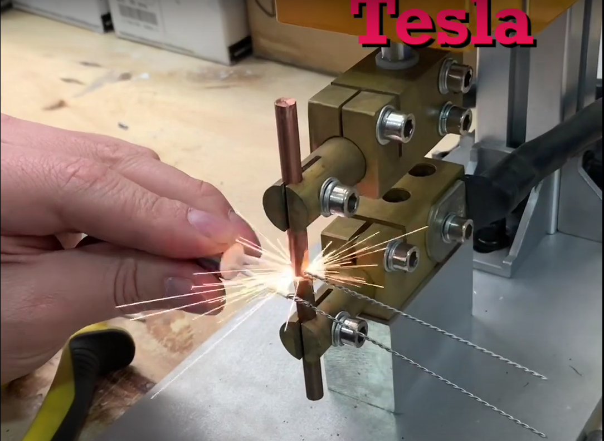
                
Odalys Villacrés

        </article>
        <article>
                <h2 id="conf12"> MI EXPERIENCIA EN F.C.T.</h2>
                

                    Mi experiencia en F.C.T. fue muy agradable, yo realice mis fct en la Empresa Eléctrica Ambato, allí me sirvió 
                    el conocimiento adquirido en clase, como el correcto uso de un multímetro para no quemarlo y saber leer diagramas 
                    para realizar correctamente las conexiones, ya que yo me encontraba en el departamento de control de pérdidas y 
                    aquí se encargaban todo lo que respecta a medidores, como su revisión y también el cambio de los mismos, tuvimos 
                    que recorrer la cuidad o salir de ella para llegar a los lugares solicitados hacer las revisiones. Los ingenieros 
                    que fueron mis encargados me explicaron de como realizar el trabajo con paciencia para que sea fácil captar lo que tenía que realizar.
                

                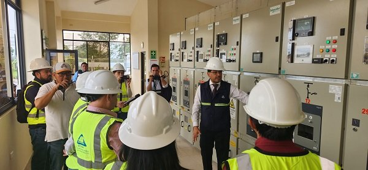
                
Elvis Sánchez

        </article>
        <article>
                <h2 id="conf13"> MIS PASANTIAS</h2>
                

                    Empezamos la solicitud para poder hacer las pasantías pero para mí mala suerte se me olvida la carpeta en el taller de 
                    electrónica así me regrese para poder llevar la carpeta pero el taller ya estaba cerrado así que tuve que ir a un ciber a 
                    hacer la carpeta de nuevo pero ya era tarde por que yo creí que ya estaba todo perdido pero a ultima momento la ingeniera 
                    nos mandó un mensaje para poder asistir el día lunes para poder hablar y pues ya nos aceptaron así que el siguiente día ya 
                    fui a hacer los practicas y la verdad fue muy ligero por que solo estaba programando medidores y calibrando y ese fui haciendo 
                    todo el meses de prácticas habían días en el que nos ponían a hacer otras actividades como hacer despacho de medidores todo esto fue con un laboratorio y aunque el supervisor de ahí si era buena gente por que nos mandaba temprano y otras veces me pedía ayuda para hacer unos documentos. Para la empresa eléctrica EEASA mis pasantías.
                

                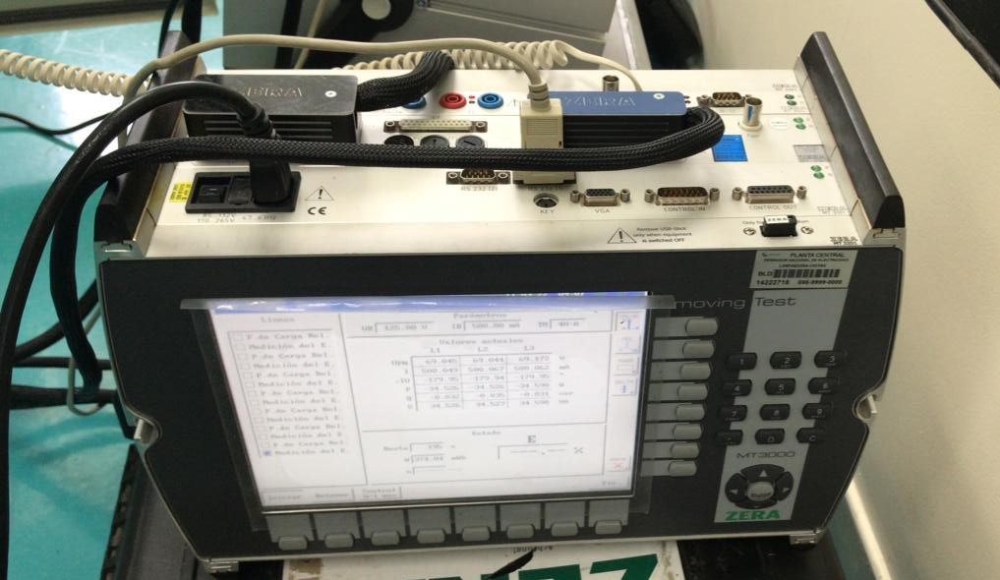
                
Kevin Pérez

        </article>
    </section>
    <footer>
        <section>
        <a href="#titulo">volver al principio</a>
        </section> 
         
        <a>13 de febrero de 2024</a>
    </footer>
</body>
</html>
